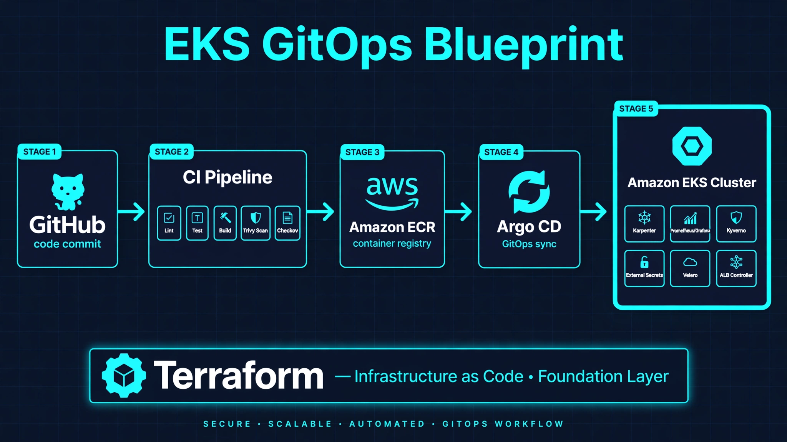
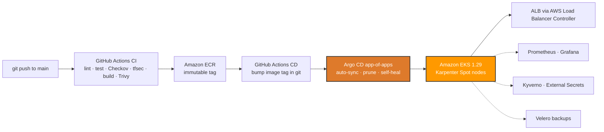

# EKS GitOps Blueprint

[](terraform/)
[](terraform/)
[](kubernetes/)
[](argocd/)
[](terraform/karpenter.tf)
[](terraform/monitoring.tf)
[](terraform/security.tf)
[](terraform/velero.tf)
[](LICENSE)

A production-shaped, end-to-end blueprint for running workloads on **Amazon EKS**
with **GitOps**: Terraform provisions the AWS foundation, GitHub Actions builds
and publishes container images, and Argo CD keeps the cluster synced to git —
no `kubectl apply` in CI, no static AWS keys, no snowflake clusters.



## Overview

- **Infrastructure as Code** — VPC (3 AZs), EKS 1.29 with managed node groups,
  IRSA/OIDC, EBS CSI driver, AWS Load Balancer Controller, Argo CD, and ECR —
  all in Terraform, with **S3 remote state + DynamoDB locking**.
- **Secure by default** — OIDC-based CI auth, IRSA-scoped IAM roles, distroless
  non-root containers, read-only root filesystem, immutable image tags,
  vulnerability scanning in the pipeline, **Kyverno admission policies**,
  **NetworkPolicies**, and secrets via **External Secrets Operator**.
- **True GitOps** — the CD pipeline commits an image-tag bump to git; Argo CD
  (**app-of-apps**: root → demo-app, monitoring, security) with automated
  sync, prune, self-heal does the deploying.
- **Cost-aware autoscaling** — **Karpenter** provisions right-sized nodes
  just-in-time with a **Spot-first** strategy and consolidates idle capacity.
- **Observable demo app** — a small Express service with `/health`, `/ready`
  and Prometheus-style `/metrics`, plus probes, HPA, PDB, ALB Ingress, and
  **kube-prometheus-stack** (Prometheus + Grafana + Alertmanager).
- **Disaster recovery** — **Velero** daily backups to S3 with 7-day retention.
- **Progressive delivery** — optional Argo Rollouts canary (20% → 50% → 100%).



Full explanation: [docs/architecture.md](docs/architecture.md) ·
Security deep-dive: [docs/security.md](docs/security.md) ·
Cost guide: [docs/cost-optimization.md](docs/cost-optimization.md).

## Prerequisites

- AWS account with permissions to create VPC, EKS, IAM, ECR resources
- [Terraform](https://developer.hashicorp.com/terraform/install) >= 1.5
- [AWS CLI](https://aws.amazon.com/cli/) v2 with credentials configured
- [kubectl](https://kubernetes.io/docs/tasks/tools/) >= 1.29
- Docker (for local app builds)
- A GitHub repository (fork this one) with a secret `AWS_ROLE_ARN` — an IAM
  role trusting GitHub's OIDC provider for ECR push from CI

## Quickstart

1. **Clone and configure Terraform**
   ```bash
   git clone https://github.com/nourhb/eks-gitops-blueprint.git
   cd eks-gitops-blueprint/terraform
   cp terraform.tfvars.example terraform.tfvars
   # edit terraform.tfvars if you want a different region or sizing
   ```

2. **Bootstrap remote state** (once — see `terraform/backend.tf`)
   ```bash
   aws s3api create-bucket --bucket eks-gitops-blueprint-tfstate \
     --region ca-central-1 \
     --create-bucket-configuration LocationConstraint=ca-central-1
   aws s3api put-bucket-versioning --bucket eks-gitops-blueprint-tfstate \
     --versioning-configuration Status=Enabled
   aws dynamodb create-table --table-name eks-gitops-blueprint-locks \
     --attribute-definitions AttributeName=LockID,AttributeType=S \
     --key-schema AttributeName=LockID,KeyType=HASH \
     --billing-mode PAY_PER_REQUEST --region ca-central-1
   ```

3. **Provision the infrastructure**
   ```bash
   terraform init
   terraform plan -out plan.tfplan
   terraform apply plan.tfplan
   ```
   Takes roughly 15–20 minutes (EKS control plane + node group).

4. **Point kubectl at the cluster**
   ```bash
   aws eks update-kubeconfig --region ca-central-1 --name blueprint-eks
   kubectl get nodes
   ```

5. **Update the image placeholder and Argo CD sources**
   - In `kubernetes/deployment.yaml`, replace `<ACCOUNT_ID>` with your AWS
     account ID (or let the CD workflow do it after the first CI run).
   - In `argocd/root-application.yaml` and `argocd/apps/demo-app.yaml`, set
     `repoURL` to your fork URL.

6. **Bootstrap the app-of-apps**
   ```bash
   kubectl apply -f ../argocd/root-application.yaml
   ```
   The root app syncs `argocd/apps/`: the demo workload plus (optionally)
   the monitoring and security platform apps. See the ownership note in
   `argocd/root-application.yaml` before enabling those two — Terraform
   installs the same charts by default, so pick one manager per release.

7. **Watch GitOps work**
   ```bash
   kubectl -n argocd get applications
   kubectl -n demo-app get pods -w
   ```
   Push a change to `app/` on `main` → CI builds & pushes the image → CD
   bumps the tag in git → Argo CD syncs → rolling update, zero manual steps.

8. **Explore the UIs**
   ```bash
   # Argo CD admin password
   kubectl -n argocd get secret argocd-initial-admin-secret \
     -o jsonpath="{.data.password}" | base64 -d; echo
   # Grafana (admin / password from terraform output)
   kubectl -n monitoring port-forward svc/kube-prometheus-stack-grafana 3000:80
   terraform output -raw grafana_admin_password
   ```

## Project structure

```
eks-gitops-blueprint/
├── app/                    # Demo Express microservice + multi-stage Dockerfile
├── terraform/              # AWS foundation (all in Terraform, S3 remote state)
│   ├── backend.tf          # S3 backend + DynamoDB state locking
│   ├── vpc.tf              # VPC, 3 AZs, private/public subnets, NAT
│   ├── eks.tf              # EKS 1.29, managed node group, IRSA/OIDC
│   ├── addons.tf           # EBS CSI, ALB controller, Argo CD (Helm), ECR
│   ├── karpenter.tf        # Karpenter Spot-first autoscaling + NodePool
│   ├── monitoring.tf       # kube-prometheus-stack (Prometheus/Grafana/AM)
│   ├── security.tf         # External Secrets Operator + Kyverno policies
│   ├── velero.tf           # Velero daily backups to S3
│   ├── policies/           # ALB controller IAM policy (upstream source)
│   └── terraform.tfvars.example
├── kubernetes/             # Workload manifests (the GitOps source of truth)
│   ├── rollout.yaml        # Argo Rollouts canary (optional alternative)
│   ├── networkpolicy.yaml  # Default-deny + DNS/ingress allowlists
│   ├── externalsecret.yaml # Secrets from AWS Secrets Manager (ESO)
│   └── poddisruptionbudget.yaml
├── argocd/                 # App-of-apps: root → demo-app, monitoring, security
│   ├── root-application.yaml
│   └── apps/
├── .github/workflows/
│   ├── ci.yaml             # Lint, test, Checkov/tfsec, build, scan, push (OIDC)
│   ├── cd.yaml             # GitOps tag-bump commit back to main
│   └── terraform.yaml      # fmt/validate/plan on PRs, manual apply only
├── docs/
│   ├── architecture.md     # Deep-dive + mermaid flow diagram
│   ├── security.md         # Defense-in-depth walkthrough
│   └── cost-optimization.md# Karpenter/Spot/NAT/gp3 cost levers
├── LICENSE
└── README.md
```

## Security notes

- **No long-lived AWS keys**: GitHub Actions authenticates via OIDC federation.
- **IRSA**: every controller (EBS CSI, ALB, Karpenter, ESO, Velero) gets a
  least-privilege IAM role bound to its Kubernetes service account.
- **Admission policies**: Kyverno rejects non-root violations, `:latest`
  tags, and containers without resource limits (Audit mode by default).
- **Network**: nodes in private subnets; only the ALB is internet-facing;
  NetworkPolicies default-deny pod traffic in `demo-app`.
- **Hardened containers**: distroless base, non-root user (65532), read-only
  root filesystem, dropped capabilities, seccomp `RuntimeDefault`.
- **Supply chain**: ECR immutable tags, scan-on-push, Trivy gate in CI,
  Checkov + tfsec on Terraform PRs.
- **Secrets**: External Secrets Operator syncs from AWS Secrets Manager —
  nothing secret lives in git.
- **Backups**: Velero daily snapshots to encrypted S3, 7-day retention.
- Full walkthrough: [docs/security.md](docs/security.md).

## Cost estimate

~$260–280/month in `ca-central-1` with defaults; Karpenter's Spot-first
consolidation usually pushes the real bill below that. Scale the node group
to zero when idle to keep just the ~$110 control-plane charge. See
[terraform/README.md](terraform/README.md) and
[docs/cost-optimization.md](docs/cost-optimization.md).

## Cleanup

```bash
cd terraform
terraform destroy
```

Delete the Argo CD `Application` / `Ingress` first if you want the ALB removed
cleanly before the cluster goes away. Full notes in
[terraform/README.md](terraform/README.md).

## Author

**Nour El Houda Bouajila** — Cloud/DevOps Engineer based in Hamilton, Canada.

- GitHub: <https://github.com/nourhb>
- Portfolio: <https://nour-portfolio-v2.vercel.app>

## License

MIT — see [LICENSE](LICENSE).
