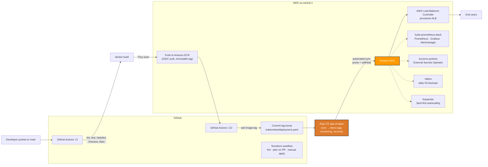

# Architecture

This document explains how the EKS GitOps Blueprint fits together and how a
code change flows from a developer's laptop to a running pod on Amazon EKS.

## Components

| Layer | Technology | Provisioned by |
|---|---|---|
| Network | VPC, 3 AZs, public/private subnets, NAT gateway | Terraform (`vpc.tf`) |
| Kubernetes | EKS 1.29, managed node group (AL2023) | Terraform (`eks.tf`) |
| Identity | IAM Roles for Service Accounts (IRSA) via OIDC | Terraform (`eks.tf`) |
| Ingress | AWS Load Balancer Controller → internet-facing ALB | Terraform (`addons.tf`, Helm) |
| Storage | EBS CSI driver | Terraform (`addons.tf`, EKS add-on) |
| GitOps operator | Argo CD with automated sync + self-heal | Terraform (`addons.tf`, Helm) + `argocd/` |
| Registry | Amazon ECR (immutable tags, scan on push) | Terraform (`addons.tf`) |
| Workload | Node.js/Express demo app (distroless, non-root) | `app/`, `kubernetes/` |
| CI | GitHub Actions → ECR (OIDC, no static keys) | `.github/workflows/ci.yaml` |
| CD | GitHub Actions tag-bump commit → Argo CD sync | `.github/workflows/cd.yaml` |
| Autoscaling | Karpenter: Spot-first just-in-time nodes + consolidation | Terraform (`karpenter.tf`) |
| Observability | kube-prometheus-stack: Prometheus, Grafana, Alertmanager (gp3 persistence) | Terraform (`monitoring.tf`) + `argocd/apps/monitoring.yaml` |
| Policy engine | Kyverno: require-non-root, disallow-latest, require-limits (Audit) | Terraform (`security.tf`) |
| Secrets | External Secrets Operator ← AWS Secrets Manager (IRSA) | Terraform (`security.tf`) + `kubernetes/externalsecret.yaml` |
| Backup | Velero: daily S3 backups, 7-day retention | Terraform (`velero.tf`) |
| Network policy | Default-deny + DNS/ingress allowlists for demo-app | `kubernetes/networkpolicy.yaml` |
| Resilience | PodDisruptionBudget (minAvailable: 1) | `kubernetes/poddisruptionbudget.yaml` |
| Progressive delivery | Argo Rollouts canary 20% → 50% → 100% (optional) | `kubernetes/rollout.yaml` |
| IaC safety | Checkov + tfsec scans, `terraform plan` on PRs, manual apply only | `.github/workflows/terraform.yaml` |
| State | S3 remote backend + DynamoDB locking | Terraform (`backend.tf`) |

## End-to-end flow

### Step by step

1. **Commit.** A change under `app/` is pushed to `main` (or opened as a PR).
2. **CI (`ci.yaml`).** On PRs: install, syntax check, tests, and a Hadolint
   scan of the Dockerfile. On pushes to `main`: additionally builds the image,
   scans it with Trivy (fails on CRITICAL/HIGH), and pushes it to ECR with an
   immutable tag like `v1.0.0-abc12345`. AWS auth uses GitHub's OIDC provider —
   there are no long-lived `AWS_SECRET_ACCESS_KEY` values anywhere.
3. **CD (`cd.yaml`).** Triggered by the successful CI run. It rewrites only the
   image tag in `kubernetes/deployment.yaml` and commits that change back to
   `main`. The workflow never talks to the cluster — that is the GitOps contract.
4. **Argo CD sync.** The in-cluster Argo CD instance polls the repo, sees the
   new desired state, and applies it with `prune: true` and `selfHeal: true`,
   so manual `kubectl` edits are reverted and deleted resources are cleaned up.
5. **Rollout.** The Deployment performs a rolling update (`maxUnavailable: 0`).
   Readiness probes gate traffic; the HPA keeps 2–6 replicas based on CPU.
6. **Ingress.** The ALB Ingress object was already reconciled by the AWS Load
   Balancer Controller into an internet-facing Application Load Balancer with
   `/health` checks, so the new pods receive traffic as soon as they are ready.

## Security design

- **No static AWS keys in CI** — GitHub OIDC federation assumes a scoped IAM
  role for ECR push.
- **IRSA everywhere** — the EBS CSI driver and the ALB controller use
  per-service-account IAM roles instead of node instance permissions.
- **Non-root containers** — distroless runtime image, `runAsNonRoot`,
  read-only root filesystem, all capabilities dropped, seccomp
  `RuntimeDefault`.
- **Immutable image tags + scan on push** in ECR; Trivy blocks vulnerable
  images before they can be deployed.
- **Network posture** — worker nodes live in private subnets; only the ALB is
  internet-facing. For production, add Kubernetes `NetworkPolicy` objects
  (Cilium or Calico) to restrict pod-to-pod traffic — noted here as a
  recommended next step rather than bundled, to keep the blueprint focused.
- **Control-plane audit logging** is enabled (`api`, `audit`,
  `authenticator`).

## Why this shape

- Terraform owns everything below the cluster (network, IAM, add-ons) because
  those resources have lifecycles tied to AWS accounts, not to git commits.
- Argo CD owns everything inside the cluster's workload namespaces because
  desired state in git is auditable, revertable, and self-healing.
- The CD pipeline edits git, not the cluster, so there is exactly one path to
  production and every deployment is a commit you can `git revert`.
